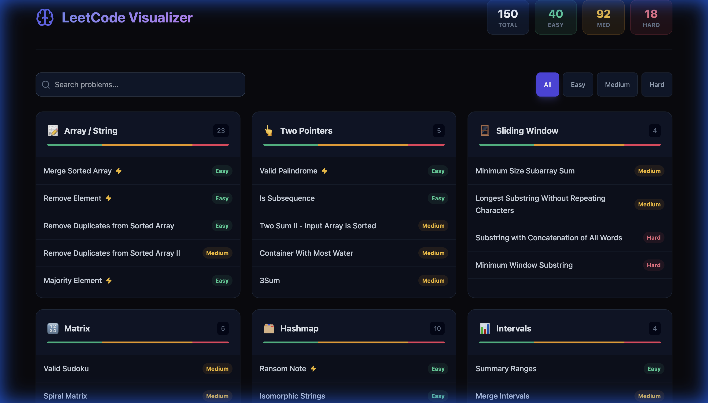
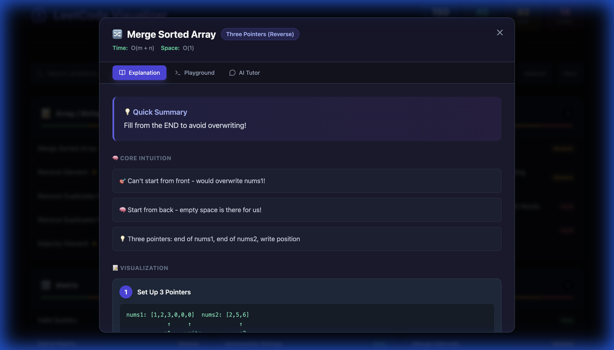
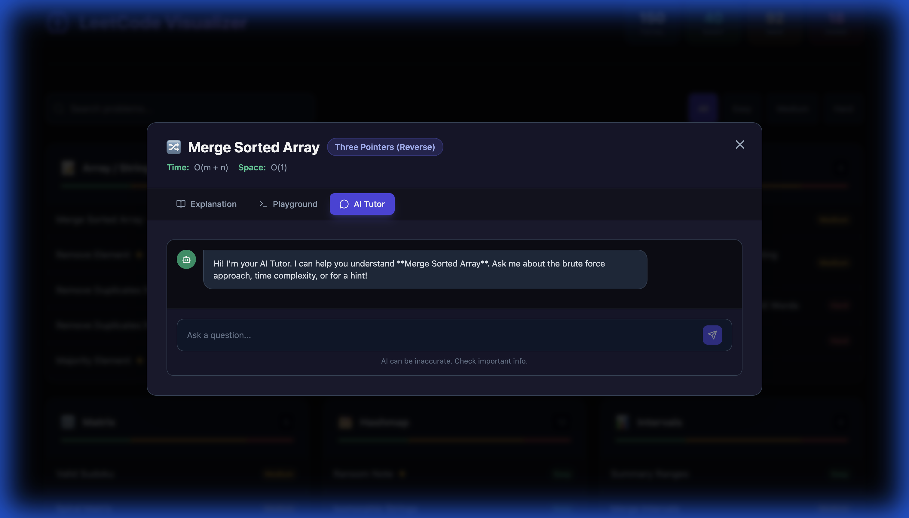

# LeetCode Visualizer

A full-stack application for visualizing LeetCode problems, generating solutions with AI, and getting personalized tutoring.

## Features

- **Problem Explorer**: Visual dashboard of Top 150 Interview questions.
- **Smart Visualizations**: AI-generated visualizations for algorithms (Two Pointers, Sliding Window, etc.).
- **Interactive Playground**: Run Python code against test cases directly in the browser.
- **AI Tutor**: Socratic agent to help you derive solutions.

## Architecture

```mermaid
graph TD
    User[User] -->|Interacts| Frontend[Frontend (Vite + React)]
    Frontend -->|HTTP Requests| API[Backend API (FastAPI)]
    
    subgraph "Backend"
        API -->|Run Code| Runner[Code Runner (Subprocess)]
        API -->|Generate/Tutor| AIEngine[AI Engine]
        AIEngine -->|Prompts| Ollama[Ollama LLM]
        API -->|Read/Write| DB[(JSON Files)]
    end
    
    subgraph "Frontend"
        Frontend -->|Components| SolutionModal
        SolutionModal -->|Tabs| TutorChat
        SolutionModal -->|Tabs| SmartVisualizer
        SolutionModal -->|Tabs| Playground
    end
```

## Application Screenshots

### Dashboard
The main dashboard categorizes problems by pattern (referenced from the Blind 75 / Top 150). It allows you to filter by difficulty and search for specific problems.


### Solution Visualizer
When you select a problem, the **Solution Modal** opens. This provides:
- A "One-Liner" summary.
- Core intuition points.
- Step-by-step visualization of the algorithm (e.g., Two Pointers moving).
- Python code.


### AI Tutor
The **AI Tutor** tab offers a Socratic chat interface. Instead of giving you the answer, it guides you to discover it yourself by:
- Asking guiding questions.
- Explaining time/space complexity.
- Discussing brute force vs. optimal approaches.


## System Flow

1.  **Exploration**: User selects a problem from the dashboard.
2.  **Generation**: If no solution exists, the request is sent to `/api/generate`.
    *   API calls `ai_engine.generate_solution_json`.
    *   AI Engine prompts Ollama (`qwen2.5-coder`) to return structured JSON.
    *   Solution is validated against test cases.
3.  **Visualization**: Frontend renders the solution using `SmartVisualizer`, showing step-by-step animations.
4.  **Tutoring**: User switches to "AI Tutor" tab.
    *   Chat messages are sent to `/api/tutor`.
    *   `ai_engine.ask_tutor` constructs a context-aware prompt.
    *   Ollama returns a Socratic response.

## Getting Started

### Prerequisites

- Python 3.10+
- Node.js 18+
- Ollama (running locally)

### Installation

1.  Install Python dependencies: (Assuming virtual env)
    ```bash
    pip install fastapi uvicorn requests
    ```
2.  Install Frontend dependencies:
    ```bash
    cd frontend
    npm install
    ```

### Running

Use the start script to run everything:

```bash
./start.sh
```

- Backend: http://localhost:8000
- Frontend: http://localhost:3000
